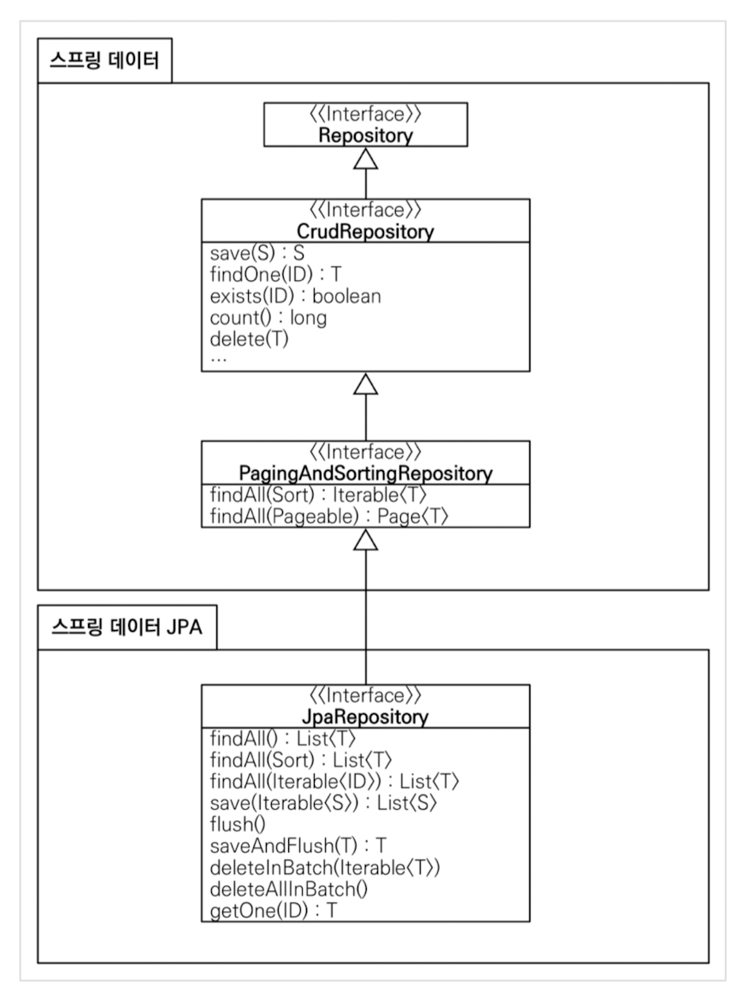

# 03. 실전! 스프링 데이터 JPA
## 프로젝트 환경설정
스프링 데이터 JPA와 DB 설정, 동작 확인
```
spring:
  datasource:
    url: jdbc:h2:tcp://localhost/~/test
    username: sa
    password:
    driver-class-name: org.h2.Driver

  jpa:
    hibernate:
      # 애플리케이션 실행시점에 테이블을 drop 하고, 다시 생성한다.
      ddl-auto: create
    properties:
      hibernate:
        format_sql: true

logging.level:
  # show_sql 옵션을 사용하면 System.out에 하이버네이트 실행 SQL을 남기고, org.hibernate.SQL 옵션을 사용하면 logger를 통해 하이버네이트 실행 SQL을 남긴다.
  org.hibernate.SQL: debug
```

쿼리 파라미터 로그 남기기
```
# 외부 라이브러리 사용
implementation 'com.github.gavlyukovskiy:p6spy-spring-boot-starter:1.5.7'
```

## 예제 도메인 모델
예) Member 테이블과 Team 테이블은 N:1 관계를 갖는다. 엔티티 구조로는 Member 엔티티에서 Team 엔티티 필드를 가지고 있고, Team 엔티티에서는 List로 Member 필드를 가진다. 

ERD에서는 member 테이블은 team_id(FK)를 가지고 team 테이블에서는 member 테이블의 속성을 가지고 있지 않다.

### 예제 도메인 모델과 동작확인
Member2, Team 엔티티, MemberTest

## 공통 인터페이스 기능
### 순수 JPA 기반 리포지토리 만들기
JPA에서 수정은 변경 감지 기능을 사용하면 된다. 트랜잭션 안에서 엔티티를 조회한 다음 데이터를 변경하면, 트랜잭션 종료 시점에 변경감지 기능이 작동해서 변경된 엔티티를 감지하고 UPDATE SQL을 실행한다.

### 공통 인터페이스 설정
Applicaton.java에 `@EnableJpaRepositores(basePackages = "jpabook.jpashop.repository")` 설정해주어야 한다. 단, 스프링부트 사용시 생략 가능

구현체가 없어도 JPA 기본 CRUD 기능 사용할 수 있음 -> 스프링 데이터 JPA가 알아서 injection 해준다.
```java
public interface MemberRepository extends JpaRepository<Member, Long> {
}
```

### 공통 인터페이스 분석
JpaRepository 인터페이스는 공통 CRUD를 제공한다



[주요 메서드]
* save : 새로운 엔티티는 저장, 기존 엔티티는 병합
* delete : 엔티티 하나 삭제
* findById : 엔티티 하나 조회 (PK 값으로)
* getOne : 엔티티를 프록시로 조회
* findAll : 모든 엔티티 조회

## 쿼리 메소드 기능
### 메소드 이름으로 쿼리 생성
### JPA NamedQuery
### @Query, 리포지토리 메소드에 쿼리 정의하기
### @Query, 값 DTO 조회하기
### 파라미터 바인딩
### 반환 타입
### 순수 JPA 페이징과 정렬
### 스프링 데이터 JPA 페이징과 정렬
### 벌크성 수정 ㅜ커리
### @EntityGraph
### JPA Hint & Lock

## 확장 기능
### 사용자 정의 리포지토리 구현
### Auditing
### Web 확장 - 도메인 클래스 컨버터
### Web 확장 - 페이징과 정렬

## 스프링 데이터 JPA 분석
### 스프링 데이터 JPA 구현체 분석
### 새로운 엔티티를 구별하는 방법

## 나머지 기능들
### Specifications(명세)
### Query By Example
### Projections
### 네이티브 쿼리
