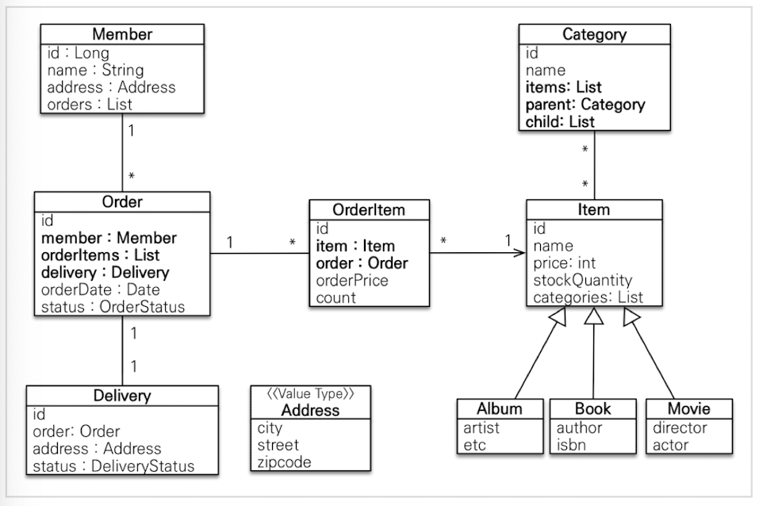
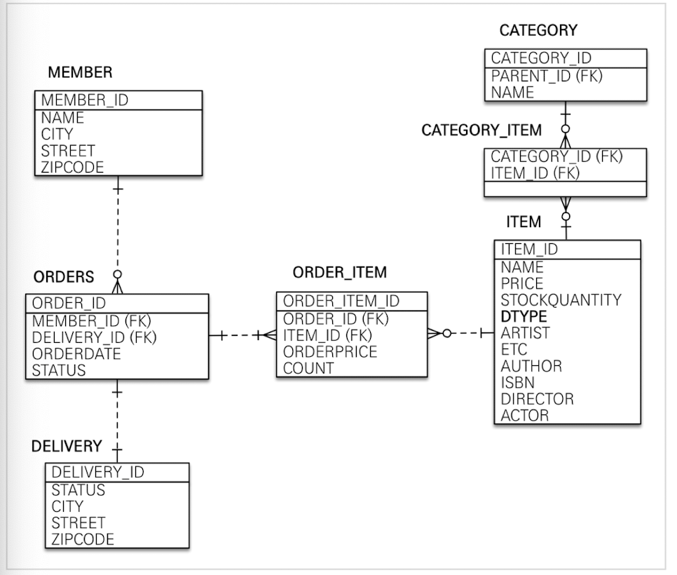

# 01. 실전! 스프링부트와 JPA 활용 1

## 1-1. 프로젝트 환경 설정
* 프로젝트 생성
* 라이브러리 살펴보기
* View 환경 설정
* H2 데이터베이스 설치

### JPA와 DB 설정, 동작 확인
[application.yml 설정](https://github.com/Limhyeonsu/inflearn_study/blob/main/jpashop/src/main/resources/application.yml)

스프링 부트를 통해 복잡한 설정이 다 자동화 되어 있다. persistence.xml도 만들 필요가 없다.

쿼리 파라미터 로그 남기는 방법으로 
1) application.yml에 org.hibernate.type: trace로 설정하는 방법
2) 외부 라이브러리를 이용하는 방법 (https://github.com/gavlyukovskiy/spring-boot-data-source-decorator)

## 1-2. 도메인 분석 설계
### 요구사항 분석
### 도메인 모델과 테이블 설계



일대다, 다대일의 양방향 관계의 경우 연관관계의 주인을 정해야 한다. 이때 외래 키가 있는 곳을 연관관계 주인으로 정하는 것이 좋다. 연관관계 주인은 단순히 외래 키를 누가 관리하느냐의 문제이지 비즈니스상 우위에 있다고 주인으로 정하면 안 된다.

### 엔티티 클래스 개발1
예제에서는 엔티티 클래스에 Getter, Setter를 모두 사용하지만 실무에서는 Setter는 꼭 필요한 경우에만 사용하는 것을 추천한다.

Item 테이블의 경우 book, album, movie 타입으로 나누어져 있어 공통 부분은 상속관계로 구현한다.
```java
@Entity
@Inheritance(strategy = InheritanceType.SINGLE_TABLE) //상속관계에 해당하는 엔티티 구현시 테이블 하나로 생성하겠다는 설정
@DiscriminatorColumn(name = "dtype") //dtype 컬럼으로 구분하겠다
@Getter
@Setter
public abstract class Item{...}
```
```java
@Entity
@DiscriminatorValue("B") //dtype 지정
@Getter @Setter
public class Book extends Item{...}
```

### 엔티티 클래스 개발2
다대다 관계는 테이블 구조로는 표현할 수 없어 매핑 테이블(Category_Item)이 필요하다. 매핑 테이블을 설정하기 위한 것은 다음과 같다. (실무에서는 다대다 매핑을 사용하지 말자!)
```java
public class Category {
    
    //...

    @ManyToMany
    @JoinTable(name = "category_item",
            joinColumns = @JoinColumn(name = "category_id"),
            inverseJoinColumns = @JoinColumn(name = "item_id"))
    private List<Item> items = new ArrayList<>();
}
```

값 타입 클래스(Address) 설정
```java
//값 타입 클래스는 변경 불가능하게 작성해야 한다. 따라서 Setter는 만들지 않는다.
@Embeddable
@Getter
public class Address {
    private String city;
    private String street;
    private String zipcode;
    
    //JPA 스펙상 엔티티나 임베디드 타입은 자바 기본 생성자를 설정해야 한다.
    protected Address() {
        
    }
    //값 타입의 경우 생성은 생성자로만 한다
    public Address(String city, String street, String zipcode) {
        this.city = city;
        this.street = street;
        this.zipcode = zipcode;
    }
}
```

JPA를 통해 생성된 테이블은 그대로 사용하지 말고 검토 후에 다듬도록 한다.

### 엔티티 설계시 주의점
__엔티티 설계시 주의 사항__
1. 엔티티에는 가급적 Setter를 사용하지 말자 : 변경 포인트가 너무 많아 유지보수가 어렵다.
2. 모든 연관관계는 `지연로딩`으로 설정한다 : 즉시로딩은 예측이 어렵고, 어떤 SQL이 실행될지 추적하기 어렵다. (JPQL 사용시 N+1 문제가 자주 발생한다.) 연관된 엔티티를 함께 DB에서 조회해야 한다면 fetch join 또는 엔티티 그래프 기능을 사용한다.
3. 컬렉션은 필드에서 초기화 하자 : 필드에서 바로 초기화 하는 것이 null 문제에서 안전해진다. 
4. 테이블, 컬럼명 생성 전략

## 1-3. 애플리케이션 구현 준비
### 구현 요구사항
* 회원 기능 - 등록, 조회
* 상품 기능 - 등록, 수정, 조회
* 주문 기능 - 상품 주문, 주문 내역 조회, 주문 취소

### 애플리케이션 아키텍처
계층형 구조를 사용한다.
* Controller : web 계층
* Service : 비즈니스 로직, 트랜잭션 처리
* Repository : JPA를 직접 사용하는 계층, 엔티티 매니져 사용
* Domain : 엔티티가 모여 있는 계층, 모든 계층에서 사용

## 1-4. 회원 도메인 개발
### 회원 리포지토리 개발
### 회원 서비스 개발
### 회원 기능 테스트

## 1-5. 상품 도메인 개발
### 상품 엔티티 개발(비즈니스 로직 추가)
### 상품 리포지토리 개발
### 상품 서비스 개발

## 1-6. 주문 도메인 개발
### 주문, 주문상품 엔티티 개발
### 주문 리포지토리 개발
### 주문 서비스 개발
### 주문 기능 테스트
### 주문 검색 기능 개발

## 1-7. 웹 계층 개발
### 홈 화면과 레이아웃
### 회원 등록
### 회원 목록 조회
### 상품 등록
### 상품 목록
### 상품 수정
### 변경 감지와 병합(merge)
### 상품 주문
### 주문 목록 검색, 취소