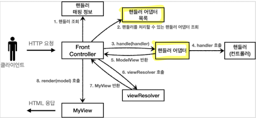
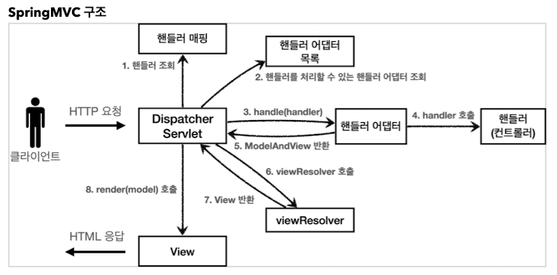

# 04. 스프링 MVC 1편 - 백엔드 웹 개발 활용 기술

## 4-1. 웹 애플리케이션 이해

### 웹 서버, 웹 애플리케이션 서버

웹은 HTTP 기반이다. HTTP 메시지에 모든 것을 전송한다. HTML, TEXT, 이미지, 음성, 영상, JSON, XML 등등..

웹 서버는 HTTP 기반으로 동작하고, __정적 리소스__ (HTML, CSS, JS, 이미지, 영상)를 제공한다. 예) Nginx, apache

웹 애플리케이션 서버(WAS)는 HTTP 기반으로 동작하고, 웹 서버 기능을 포함하고 있다. 프로그램 코드를 실행해서 애플리케이션 로직을 수행한다. 예) 톰캣, Jetty..

[웹 서버와 웹 애플리케이션 서버의 차이]

* 웹 서버는 정적 리소스, WAS는 애플리케이션 로직
* 자바에서는 서블릿 컨테이너 기능을 제공하면 WAS라고 한다.
* WAS는 애플리케이션 코드를 실행하는데 더 특화되어 있다.

웹 시스템에서는 WAS, DB만으로 시스템을 구성할 수 있다. WAS는 정적 리소스, 애플리케이션 로직 모두 제공한다. WAS가 너무 많은 역할을 담당하고 있어, 서버 과부하 우려가 있다. WAS에서 장애가 발생하면
오류 화면도 노출이 불가능하다. 그래서 `웹 시스템 구성을 WEB, WAS, DB`로 구성하여 정적 리소스는 웹 서버가 동적인 처리가 필요한 것은 WAS에 요청을 위임하여 WAS는 중요한 애플리케이션 로직 처리를
전담한다.

이렇게 나누게 되면 리소스를 효율적으로 관리할 수 있다. 정적 리소스가 많이 사용되면 WEB 서버를 증설하고, 애플리케이션 리소스가 많이 사용되면 WAS를 증설하면 된다. 정적 리소스만 제공하는 웹 서버는 자 죽지
않고 WAS 서버는 잘 죽는다. 그래서 WAS, DB에서 장애가 발생하는 경우 웹 서버가 오류 화면을 제공할 수 있다.

### 서블릿

HTML Form 데이터 전송시 웹 애플리케이션 서버를 직접 구현하는 경우 처리해야 하는 업무가 굉장히 많다.

* 서버 TCP/IP 연결대기, 소켓 연결
* HTTP 요청 메시지 파싱해서 읽기
* POST 방식, URL 인지
* Content-Type 확인
* HTTP 메시지 바디 내용 파싱
* 저장 프로세스 실행
* `비즈니스 로직 실행` > 데이터베이스에 저장 요청
* HTTP 응답 메시지 생성 시작
* TCP/IP에 응답 전달, 소켓 종료

여기서 중요한 것은 비즈니스 로직 실행 부분인데 부수적으로 해야할 일이 너무 많다. 이때 서블릿을 지원하는 WAS를 사용하면 비즈니스 로직을 제외한 처리 부분을 서블릿이 처리해준다.

```
@WebServlet(name="helloServlet", urlPatterns="/hello")
public class HelloServlet extends HttpServlet {
    @Override
    protected void service(HttpServletRequest request, HttpServletResponse response) {
        //애플리케이션 로직 실행
    }
}
```

/hello URL이 호출되면 서블릿 코드가 실행되고 HTTP 요청, 응답을 편리하게 사용할 수 있는 HttpServletRequest, HttpServletResponse 객체를 제공해 준다. 이로인해 개발자는
HTTP 스펙을 매우 편리하게 사용할 수 있다.

[HTTP 요청 응답 흐름]

* WAS는 Request, Response 객체를 새로 만들어서 서블릿 객체 호출
* 개발자는 Request 객체에서 HTTP 요청 정보를 편리하게 꺼내서 사용
* 개발자는 Response 객체에 HTTP 응답 정보를 편리하게 입력
* WAS는 Response 객체에 담겨있는 내용으로 HTTP 응답 정보를 생성

[서블릿 컨테이너]

* 서블릿을 지원하는 WAS를 서블릿 컨테이너라고 한다.
* 서블릿 컨테이너는 서블릿 객체를 생성, 초기화, 호출, 종료하는 생명주기를 관리한다.
* 서블릿 객체는 싱글톤으로 관리한다. (컨테이너 종료시 함께 종료)
* JSP도 서블릿으로 변환되어서 사용한다.
* 동시 요청을 위한 멀티 쓰레드 처리를 지원한다.

### 동시 요청 - 멀티 쓰레드

쓰레드는 애플리케이션 코드를 하나하나 순차적으로 실행하는 것, 쓰레드가 없다면 자바 애플리케이션 실행이 불가능하다. 쓰레드는 한 번에 하나의 코드 라인만 수행하고 동시 처리가 필요하다면 쓰레드를 추가로 생성해야
한다.

다중 요청에 하나의 쓰레드만 사용하게 되면 하나의 쓰레드가 요청 처리중 지연이 발생했을 때 다른 요청이 들어오면 대기하고 있어야 해서 모든 요청이 수행되지 못한다.

요청 마다 쓰레드를 생성하게 되면 다음과 같은 장단점이 있다.

* 장점
    * 동시 요청 처리 가능
    * 리소스가 허용할 때까지 처리 가능
    * 하나의 쓰레드가 지연되어도 나머지 쓰레드는 정상 작동
* 단점
    * 쓰레드 생성비용은 비싸다 (응답속도 저하)
    * 컨텍스트 스위칭 비용이 발생한다.(예. 1코어에 2쓰레드가 실행중인 경우 2개를 동시에 수행하지 못 한다. 쓰레드를 전환할 때 드는 비용이 컨텍스트 스위칭 비용)
    * 쓰레드 생성에 제한이 없다.(너무 많은 요청 발생시 CPU, 메모리 임계점을 넘어서 서버가 죽을 수 있다.)

쓰레드 풀 : 요청마다 쓰레드 생성의 단점을 보완한 것으로 필요한 쓰레드를 쓰레드 풀에 보관하고 관리한다. 생성 가능한 쓰레드의 최대치를 관리한다.(톰캣은 최대 200개 기본)

쓰레드가 필요하면 이미 생성되어 있는 쓰레드 풀에서 꺼내서 사용하고, 사용을 종료하면 쓰레드 풀에 해당 쓰레드를 반납한다. 최대 쓰레드가 모두 사용중이라면 기다리는 요청을 거절하거나 대기하도록 설정 가능하다.
쓰레드가 미리 생성되어 있어 쓰레드를 생성하고 종료하는 비용이 절약되고 응답 시간이 빠르다. 생성가능한 쓰레드의 최대치가 있으므로 너무 많은 요청이 들어와도 기존 요청은 안전하게 처리할 수 있다.

WAS의 주요 튜닝 포인트는 `최대 쓰레드의 수`이다. 이 값이 너무 낮으면 동시 요청이 많을 때 클라이언트 측에 응답 지연이 발생하고, 값을 너무 높게 설정하면 서버가 다운될 수 있다. 쓰레드 풀의 적정
숫자는 __애플리케이션 로직의 복잡도, CPU, 메모리, IO 리소스 상황에__ 따라 모두 다르다. 최대한 실제 서비스와 유사하게 성능테스트를 하여 적절하게 설정하자.

WAS에서 멀티 쓰레드를 지원하기 때문에 개발자가 멀티 쓰레드 관련 코드를 신경쓰지 않아도 된다.

### HTML, HTTP API, CSR, SSR

* 정적리소스 - 고정된 HTML 파일, CSS, JS, 이미지, 영상 등을 제공
* HTML 페이지 - 동적으로 필요한 HTML 파일을 생성해서 전달
* HTTP API - HTML이 아닌 데이터를 전달, 주로 JSON 형식을 사용

HTTP API : 다양한 시스템에서 호출할 때 사용한다. 데이터만 주고 받고 UI 화면이 필요한 경우 클라이언트가 별도로 처리한다. 주로 JSON 형태로 데이터 통신을 하고, 웹 클라이언트 to 서버, 서버 to
서버, 앱 클라이언트 to 서버 등이 있다.

SSR(서버 사이드 렌더링) : HTML 최종 결과를 `서버`에서 만들어서 웹 브라우저에 전달, 주로 정적인 화면에 사용하고, 관련 기술로는 JSP, 타임리트 등이 있다.

CSR(클라이언트 사이드 렌더링) : HTML 결과를 자바스크립트를 사용해 웹 브라우저에서 동적으로 생성해서 적용한다. 주로 동적인 화면에 사용하고 웹 환경을 앱처럼 필요한 부분만 변경할 수 있다. 관련 기술로는
React, Vue 등이 있다.

### 자바 백엔드 웹 기술 역사

과거 기술 : 서블릿(HTML 생성이 어려움) > JSP(HTML 생성은 편리하지만 비즈니스 로직까지 너무 많은 역할을 담당한다.) > MVC 패턴 사용 > MVC 프레임워크 사용

현재는 애노테이션 기반의 스프링 MVC가 등장했다. 그리고 서버를 내장하고 있는 스프링 부트가 등장하면서 빌드 배포가 단순화 되었다.

[자바 웹 기술]

* Web Servlet(Spring MVC)
* Wev Reactive(Spring Web Flux) - 비동기 넌 블러킹 처리, 최소 쓰레드로 최대 성능을 낸다(예. 쓰레드의 갯수를 CPU 코어수에 맞춰서 쓰레드가 계속 돌아간다. 그로 인해 컨텍스트 스위칭
  비용이 효율화 된다.), 함수형 스타일로 개발되어 동시처리 코드가 효율적이다. 단점으로는 기술적 난이도가 매우 높고, RDB를 사용할 수 없다. 아직 실무에서 많이 사용하지 않는다.

자바 뷰 템플릿의 역사

* JSP - 속도가 느리고, 기능이 부족하다.
* Freemarker, Velocity - 속도 문제를 해결했고, 다양한 기능을 제공한다.
* Thymeleaf - HTML의 모양을 유지하면서 뷰 템플릿 적용이 가능하고, 스프링 MVC와 강력한 기능 통합, 단 성능은 프리마커와 벨로시티가 더 빠르다.

## 4-2. 서블릿
### 프로젝트 생성
### Hello 서블릿
서블릿은 톰캣 같은 웹 애플리케이션 서버를 직접 설치하고, 그 위에 서블릿 코드를 클래스 파일로 빌드해서 올린 다음, 톰캣 서버를 실행하면 된다.
스프링 부트를 사용하면 톰캣 서버를 내장하고 있어, 서버 설치 없이 편리하게 서블릿 코드를 실행할 수 있다.

스프링 부트에서는 서블릿을 직접 등록해서 사용할 수 있도록 `@ServletComponentScan`을 지원한다.

```java
@ServletComponentScan //내 패키지 및 하위 패키지에 해당하는 servlet을 찾아서 자동으로 등록
@SpringBootApplication
public class ServletApplication {
    public static void main(String[] args) {
        SpringApplication.run(ServletApplication.class, args);
    }
}
```

[서블릿 등록]
```java
//servlet은 일단 HttpServlet을 상속받아야 한다.
//name(서블릿 이름), urlPattern(URL 매칭)은 중복이 있으면 안된다.
@WebServlet(name="helloServlet", urlPatterns = "/hello")
public class HelloServlet extends HttpServlet {

    //HTTP 요청을 통해 매핑된 URL이 호출되면 서블릿 컨테이너는 다음 메서드를 실행한다.
    @Override
    protected void service(HttpServletRequest request, HttpServletResponse response) throws ServletException, IOException {
        //.....
    }
}
```

application.properties에 logging.level.org.apache.coyote.http11=debug를 설정하면 서버가 받은 HTTP 요청 메시지를 출력해준다. (운영서버에서는 성능저하가 발생할 수 있으므로 개발 단계에서만 사용하자)

### HttpServletRequest 개요
HTTP 요청 메시지를 개발자가 직접 파싱하여 사용할 수 있지만 매우 불편하다. 서블릿은 HTTP 요청 메시지를 편리하게 사용할 수 있도록 개발자 대신에 HTTP 요청 메시지를 파싱한다. 그리고 그 결과를 HttpServletRequest 객체에 담아서 제공한다.

* Start Line : HTTP 메소드, URL, 쿼리 스트링, 스키마, 프로토콜
* 헤더 : 헤더 조회
* 바디 : form 파라미터 형식 조회, message body 데이터 직접 조회

* 임시저장소 기능 : 저장(request.setAttribute(name, value)), 조회(request.getAttribute(name))
* 세션 관리 기능 : request.getSession(create:true)

HttpServletRequest, HttpServletResponse를 사용할 때 가장 중요한 점은 이 객체들이 HTTP 요청, 응답 메시지를 편리하게 사용하도록 도와주는 객체라는 점이다. 깊이 있는 이해를 하기 위해서는 HTTP 스펙이 제공하는 요청, 응답 메시지 자체를 이해해야 한다.

### HttpServletRequest 기본 사용법
[hello.servlet.basic.request의 RequestHeaderServlet 참고](https://github.com/Limhyeonsu/inflearn_study/blob/main/servlet/src/main/java/hello/servlet/basic/request/RequestHeaderServlet.java)

### HTTP 요청 데이터 개요
* GET - 메세지 바디 없이, URL의 쿼리 파라미터에 데이터를 포함해서 전달 예) 검색, 필터, 페이징 등..
* POST - HTTP Form 사용, 메세지 바디에 쿼리 파라미터 형식으로 전달 username=hello&age=20
* HTTP message body - HTTP API에서 주로 사용 JSON, XML, TEXT (주로 JSON 사용함) 
  * POST, PUT, PATCH

### HTTP 요청 데이터 - GET 쿼리 파라미터
```java
@Override
protected void service(HttpServletRequest request, HttpServletResponse response) throws ServletException, IOException {
    //전체 파라미터 조회
    Enumeration<String> parameterNames = request.getParameterNames();

    //파라미터 명에 따른 값 꺼내기
    String username = request.getParameter("username");
    String age = request.getParameter("age");

    //?username=hello&age=20&username=hello2  ==> username을 중복으로 넘길수도 있다
    //이름이 같은 복수 파라미터 조회
    String[] usernames = request.getParameterValues("username");

}
```

### HTTP 요청 데이터 - POST HTML Form
메세지 바디에 쿼리파라미터 형식으로 전달되기 때문에 GET 요청과 동일하게 데이터를 꺼낼 수 있다.

request.getParameter()는 GET URL 쿼리 파라미터 형식도 지원하고, POST HTML Form 형식도 지원한다.

content-type은 application/x-www-form-urlencoded로 지정해주어야 한다.

### HTTP 요청 데이터 - API 메시지 바디 - 단순 텍스트
```java
@Override
protected void service(HttpServletRequest request, HttpServletResponse response) throws ServletException, IOException {
    //메세지 바디 내용을 바이트 코드로 받아옴
    ServletInputStream inputStream = request.getInputStream();
    //바이트 코드 -> String
    String messageBody = StreamUtils.copyToString(inputStream, StandardCharsets.UTF_8);
    System.out.println(messageBody);
}
```

### HTTP 요청 데이터 - API 메시지 바디 - JSON
content-type은 application/json

```java
private ObjectMapper objectMapper = new ObjectMapper();

@Override
protected void service(HttpServletRequest request, HttpServletResponse response) throws ServletException, IOException {

    ServletInputStream inputStream = request.getInputStream();
    String messageBody = StreamUtils.copyToString(inputStream, StandardCharsets.UTF_8);


    System.out.println(messageBody); //Json 문자열 그대로 출력됨

    HelloData helloData = objectMapper.readValue(messageBody, HelloData.class);
    System.out.println("helloData.username = " + helloData.getUsername());
    System.out.println("helloData.age = " + helloData.getAge());
}
```

### HTTPServletResponse  기본 사용법
### HTTP 응답 데이터 - 단순 텍스트, HTML
단순 텍스트 : writer.println("ok");

HTML
```java
response.setContentType("text/html");
response.setCharacterEncoding("utf-8");

PrintWriter writer = response.getWriter();
writer.println("<html>");
writer.println("<body>");
writer.println(" <div>안녕?</div>");
writer.println("</body>");
writer.println("</html>");
```

### HTTP 응답 데이터 - API JSON
content-type : application/json으로 지정하면 스펙상 utf-8 형식을 사용하도록 지원하고 있다. 그래서 추가로 utf-8을 설정할 필요는 없다. 

## 4-3. 서블릿, JSP, MVC 패턴
### 회원관리 웹 애플리케이션 요구사항
* 회원 저장
* 회원 목록 조회

__실무에서 Map 사용시 동시성 문제를 고려해야할 땐 ConcurrentHashMap, AtomicLong 사용__

### 서블릿으로 회원관리 웹 애플리케이션 만들기
서블릿을 사용하면 자바코드로 HTML을 작성해야하기 때문에 상당히 불편하다.

```java
w.write("<!DOCTYPE html>\n" +
        "<html>\n" +
        "<head>\n" +
        "    <meta charset=\"UTF-8\">\n" +
        "    <title>Title</title>\n" +
        "</head>\n" +
        "<body>\n" +
        "<form action=\"/servlet/members/save\" method=\"post\">\n" +
        "    username: <input type=\"text\" name=\"username\" />\n" +
        "    age:      <input type=\"text\" name=\"age\" />\n" +
        " <button type=\"submit\">전송</button>\n" + "</form>\n" +
        "</body>\n" +
        "</html>\n");

```

서블릿과 자바 코드만으로 HTML을 만들면 매우 복잡하고 비효율적이다. 이로인해 등장한 것이 템플릿 엔진이다. 템플릿 엔진을 사용하면 HTML 문서에서 필요한 곳만 코드를 적용해서 동적으로 변경할 수 있다.

대표적인 템플릿 엔진에서 JSP, Thymeleaf 등이 있다.

*JSP는 성능과 기능면에서 다른 템플릿 엔진과 경쟁에서 밀리고 있다. 스프링부트에서는 거의 권장하지 않으므로 강의에서는 스프링에 잘 통합되는 Thymeleaf를 사용한다. 

### JSP로 회원관리 웹 애플리케이션 만들기
JSP 라이브러리 추가 필요 > .jsp 파일 생성

/webapp/jsp 하위 참고

```
//JSP 문서라는 의미다. JSP 문서는 이렇게 시작해야 한다. 확장자는 .jsp
<%@ page contentType="text/html;charset=UTF-8" language="java" %>
```

* <% ~~ %> 안에 자바 코드를 입력할 수 있다.
* HTML 중심으로 되어있고, 부분 부분 자바코드를 입력한다.
* <%= ~~ %> 자바코드 출력

서블릿과 JSP의 한계 : 서블릿으로 개발시에는 HTML 코드가 자바 코드에 섞여있어 지저분하고 복잡했다. JSP의 경우 다양한 코드가 JSP에 노출되어 있고, 너무 많은 역할을 한다.

이러한 한계를 극복할 MVC 패턴이 등장했다. 비즈니스 로직은 다른곳에서 처리하고 JSP에서는 HTML로 화면을 그리는 일에 집중하도록 했다. 

### MVC 패턴 - 개요
* 너무 많은 역할 : 서블릿이나 JSP 만으로 비즈니스 로직과 뷰 렌더링까지 모두 처리하면 너무 많은 역할을 하게 된다. 그래서 유지보수가 어려워진다.
* 변경의 라이프 사이클 : 화면 수정과 비즈니스 로직 수정은 각각 다르게 발생할 수 있고, 서로에게 영향을 주지 않는다. 그런데 이것을 하나의 코드로 관리하는 것은 좋지 않다.
* 기능 특화 : 뷰 템플릿은 화면 렌더링에 최적화되어 있기 때문에 화면만 담당하는 것이 가장 효과적이다.
* Model View Controller
  * Controller : HTTP 요청을 받아 파라미터를 검증하고, 비즈니스 로직을 실행한다. 그리고 뷰에 전달할 데이터를 모델에 담는다.
  * Model : 뷰에 출력할 데이터를 담아둔다.
  * View : 모델에 담긴 데이터를 사용해서 화면을 그리는 일에 집중한다. (HTML 생성)

### MVC 패턴 - 적용
서블릿을 컨트롤러로 사용하고, JSP를 뷰, Model은 HttpServletRequest 객체를 사용한다. request.setAttribute(), request.getAttribute()를 사용하여 데이터를 보관하고, 조회할 수 있다.

* dispatcher.forward() - 다른 서블릿이나 JSP로 이동할 수 있다. 서버 내부에서 다시 호출이 발생한다.
* /WEB-INF - 이 경로안에 JSP 파일이 있으면 외부에서 직접 JSP를 호출할 수 없다. 항상 컨트롤러를 통해서 호출된다.
* redirect - 클라이언트에 응답이 나갔다가 클라이언트에서 redirect 경로로 다시 요청한다. (클라이언트가 인지, URL 경로도 실제로 변경됨)
* forward - 서버 내부에서 일어나는 호출이라 클라이언트에서 인지하지 못함

JSP는 ${} 문법을 제공하는데 이 문법을 사용하여 request의 attribute에 담긴 데이터를 편하게 조회할 수 있다.

```
<%@ taglib prefix="c" uri="http://java.sun.com/jsp/jstl/core"%>


<c:forEach var="item" items="${members}">
    <tr>
      <td>${item.id}</td>
      <td>${item.username}</td>
      <td>${item.age}</td>
    </tr>
  </c:forEach>
  
```
jstl을 사용해서 간편하게 tag를 사용해서 for문 등을 사용할 수 있다.

### MVC 패턴 - 한계
[MVC 컨트롤러의 단점]
* 포워드 중복
* ViewPath에 중복
* 사용하지 않는 코드 - ex)response
* 공통 처리의 어려움

위 문제들을 해결하기 위해 프론트 컨트롤러 패턴을 도입하면 된다.

## 4-4. MVC 프레임워크 만들기
### 프론트 컨트롤러 패턴 소개
프론트 컨트롤러 도입 전에는 공통적인 코드가 각각의 컨트롤러에 들어가 있어 컨트롤러가 추가되면 공통 로직의 중복이 늘어난다.

프론트 컨트롤러가 도입되면 프론트 컨트롤러에서 공통의 코드를 모아 넣고 요청에 맞는 컨트롤러를 찾아서 호출한다. 프론트 컨트롤러를 제외한 나머지 컨트롤러에서는 서블릿을 사용하지 않아도 된다.

스프링 웹 MVC의 DispatcherServlet이 FrontController 패턴으로 구현되어 있다.

### 프론트 컨트롤러 도입 - v1
FrontControllerServletV1 에서 /front-controller/v1를 포함한 하위 모든 요청은  이 서블릿에서 받아들인다.

그리고 ControllerMap에서 매핑된 URL 키값으로 호출할 컨트롤러를 가져온다.

### View 분리 - v2
모든 컨트롤러에서 뷰로 이동하는 부분에 중복을 별도의 뷰 객체를 생성한다.

```java
public class MyView {
    
    private String viewPath;
    
    public MyView(String viewPath) {
        this.viewPath = viewPath;
    }
    
    public void render(HttpServletRequest request, HttpServletResponse response) throws ServletException, IOException {
        RequestDispatcher dispatcher = request.getRequestDispatcher(viewPath);
        dispatcher.forward(request, response);
    }
}

```

각각의 컨트롤러는 return new MyView("/WEB-INF/views/new-form.jsp"); 식의 값을 리턴하게 만들어준다.

그리고 서블릿에서는 이런식으로 반환된 MyView 객체의 render를 호출하게 해준다. 

```
MyView myView = controller.process(request, response);
myView.render(request, response);
```

### Model 추가 - v3
계속 서블릿에 종속적인 HttpServletRequest를 사용했는데 서블릿의 종속성을 제거하기 위해 Model을 직접 만든다. 그리고 컨트롤러에서 뷰의 물리적인 위치 경로를 지정하였는데 향후 뷰의 폴더의 위치가 바뀌더라도 수정하지 않도록 뷰의 논리 이름을 반환하도록 한다.

### 단순하고 실용적인 컨트롤러 - v4
기본적인 구조는 V3와 같으나 대신 컨트롤러가 ModelView를 반환하지 않고 ViewName만 반환하도록한다.

```java
public class MemberFormControllerV4 implements ControllerV4 {

    @Override
    public String process(Map<String, String> paramMap, Map<String, Object> model) {
        return "new-from";
    }
}
```

### 유연한 컨트롤러 - v5
만약 어떤 사람은 ControllerV3, 다른 사람은 ControllerV4 방식으로 개발하고 싶은 경우 완전히 다른 두개의 인터페이스라 호환이 불가능하다 이럴때 `어댑터 패턴`을 사용해서 다양한 방식의 컨트롤러를 처리하도록 할 수 있다.



```java
public interface MyHandlerAdapter {
    // 파라미터로 들어오는 handler 객체는 컨트롤러를 말한다.
    // 어댑터가 해당 컨트롤러를 처리할 수 있는지 판단하는 메서드
    boolean supports(Object handler);
    
    ModelView handle(HttpServletRequest request, HttpServletResponse response, Object handler) throws ServletException, IOException;
}
```

어댑터는 실제 컨트롤러를 호출하고, 그 결과로 ModelView를 반환해야 한다.

```java
public class ControllerV4HandlerAdapter implements MyHandlerAdapter {
    //....
  
    @Override
    public ModelView handle(HttpServletRequest request, HttpServletResponse response, Object handler) throws ServletException, IOException {
        ControllerV4 controller = (ControllerV4) handler;

        Map<String, String> paramMap = createParamMap(request);
        Map<String, Object> model = new HashMap<>();

        //어댑터가 호출하는 ControllerV4에서는 뷰의 이름을 반환함
        String viewName = controller.process(paramMap, model);

        //어댑터에서는 뷰의 이름이 아닌 ModelView를 만들어서 반환해야한다.
        ModelView mv = new ModelView(viewName);
        mv.setModel(model);
        return mv;
    }
    
    //.....

}
```

```java
@WebServlet(name = "frontControllerServletV5", urlPatterns = "/front-controller/v5/*")
public class FrontControllerServletV5 extends HttpServlet {

    //기존 private Map<String, ControllerV3> controllerMap = new HashMap<>(); 였음
    private final Map<String, Object> handlerMappingMap = new HashMap<>();
    private final List<MyHandlerAdapter> handlerAdapters = new ArrayList<>();

    public FrontControllerServletV5() {
        initHandlerMappingMap();
        initHandlerAdapters();
}
    private void initHandlerMappingMap() {
        handlerMappingMap.put("/front-controller/v5/v3/members/new-form", new MemberFormControllerV3());
        handlerMappingMap.put("/front-controller/v5/v3/members/save", new MemberSaveControllerV3());
        handlerMappingMap.put("/front-controller/v5/v3/members", new MemberListControllerV3());

        handlerMappingMap.put("/front-controller/v5/v4/members/new-form", new MemberFormControllerV4());
        handlerMappingMap.put("/front-controller/v5/v4/members/save", new MemberSaveControllerV4());
        handlerMappingMap.put("/front-controller/v5/v4/members", new MemberListControllerV4());
    }

    private void initHandlerAdapters() {
        handlerAdapters.add(new ControllerV3HandlerAdapter());
        handlerAdapters.add(new ControllerV4HandlerAdapter());
    }

    @Override
    protected void service(HttpServletRequest request, HttpServletResponse response)  throws ServletException, IOException {

        Object handler = getHandler(request);
        if (handler == null) {
            response.setStatus(HttpServletResponse.SC_NOT_FOUND);
            return;
        }

        MyHandlerAdapter adapter = getHandlerAdapter(handler);
        ModelView mv = adapter.handle(request, response, handler);

        MyView view = viewResolver(mv.getViewName());
        view.render(mv.getModel(), request, response);
    }

    private Object getHandler(HttpServletRequest request) {
        String requestURI = request.getRequestURI();
        return handlerMappingMap.get(requestURI);
    }

    private MyHandlerAdapter getHandlerAdapter(Object handler) {
        for (MyHandlerAdapter adapter : handlerAdapters) {
            if (adapter.supports(handler)) {
                return adapter;
            }
        }
        throw new IllegalArgumentException("handleradapter를 찾을 수 없습니다. handler=" + handler);
    }

    private MyView viewResolver(String viewName) {
        return new MyView("/WEB-INF/views/" + viewName + ".jsp");
    }
}
```

## 4-5. 스프링 MVC - 구조 이해
### 스프링 MVC 전체 구조



DispatcherServlet 도 부모 클래스에서 HttpServlet을 상속받아 사용하고, 서블릿으로 동작한다. 스프링 부트에서는 DispatcherServlet을 서블릿으로 자동 등록하면서 모든 경로 (urlPatterns="/")에 대해서 매핑한다.

[동작순서]
1. 핸들러 조회 - 요청 URL에 매핑된 핸들러(컨트롤러) 조회
2. 핸들러 어댑터 조회 - 핸들러를 실행할 수 있는 핸들러 어댑터 조회
3. 핸들러 어댑터 실행 - 핸들러 어댑터 실행
4. 핸들러 실행 - 핸들러 어댑터가 실제 핸들러를 실행
5. ModelAndView 반환 - 핸들러 어댑터는 핸들러가 반환하는 정보를 ModelAndView로 변환해서 반환
6. viewResolver 호출
7. View 반환 - 뷰 리졸버는 뷰의 논리 이름을 물리 이름으로 바꾸고, 렌더링 역할을 담당하는 뷰 객체를 반환
8. 뷰 렌더링

스프링 MVC는 DispatcherServlet 코드의 변경 없이 원하는 기능을 변경하거나 확장할 수 있다. 대부분 확장 가능할 수 있게 인터페이스로 제공하고 있다. 이 인터페이스를 구현해서 DispatcherServlet에 등록하면 우리만의 컨트롤러를 만들수 있다.

### 핸들러 매핑과 핸들러 어댑터
```java
//과거 버전의 스프링 컨트롤러
@Component("/springmvc/old-controller")
public class OldController implements Controller {

    @Override
    public ModelAndView handleRequest(HttpServletRequest request, HttpServletResponse response) throws Exception {
        System.out.println("OldController handleRequest");
        return null;
    }
}

```

스프링 빈의 이름으로 핸들러를 찾을 수 있는 핸들러 매핑이 필요하고, 핸들러 매핑을 통해 찾은 핸들러를 실행할 수 있는 어댑터가 필요한데 스프링에서 대부분 구현해두었기 때문에 개발자가 직접 만들일이 거의 없다.

[HandlerMapping의 우선순위]
1. RequestMappingHandlerMapping - @RequestMapping에서 사용
2. BeanNameUrlHandlerMapping - 스프링 빈의 이름으로 핸들러를 조회

[HandlerAdapter의 우선순위]
1. RequestMappingHandlerAdapter - @RequestMapping에서 사용
2. HttpRequestHandlerAdapter - HttpRequestHandler 처리
3. SimpleControllerHandlerAdapter - Controller 인터페이스

실무에서는 주로 @RequestMapping을 주로 사용한다.

### 뷰 리졸버
뷰의 물리이름을 사용하기 위해서는 설정 파일에 설정이 필요하다. (application.properties)

```properties
spring.mvc.view.prefix=/WEB-INF/views/
spring.mvc.view.suffix=.jsp
```

스프링 부트는 InternalResourceViewResolver라는 뷰 리졸버를 자동으로 등록하는데 이때 설정파일에 등록한 위 설정정보를 사용해서 등록한다. (설정없이 전체 경로를 ModelAndView에 담아도 가능하긴 함)

[뷰 리졸버 우선순위]
1. BeanNameViewResolver - 빈 이름으로 뷰를 찾아서 반환
2. InternalResourceViewResolver - JSP를 처리할 수 있는 뷰를 반환

InternalResourceViewResolver는 JSTL 라이브러리가 있으면 JstlView를 반환한다. 그리고 다른 뷰는 실제 뷰를 렌더링하지만 JSP는 forward()를 통해 해당 JSP로 이동해야 렌더링 된다.

### 스프링 MVC - 시작하기
스프링은 애노테이션을 활용한 매우 유연하고, 실용적인 컨트롤러를 만들었다. `@RequestMappring` 애노테이션을 사용하는 컨트롤러이다.

```java
@Controller
public class SpringMemberFormControllerV1 {

    @RequestMapping("/springmvc/v1/members/new-form")
    public ModelAndView process() {
        return new ModelAndView("new-form");
    }
}
```
* @Controller - 스프링에서 자동으로 빈 등록을 해준다.(내부에 @Component가 있음)
* @RequestMapping - 요청 정보를 매핑한다.
* ModelAndView - 모델과 뷰 정보를 담아서 반환

@Controller 대신에 Class 레벨에 @Component와 @RequestMapping을 붙여도 된다.

```java
@Component
@RequestMapping
public class SpringMemberFormControllerV1 {

    @RequestMapping("/springmvc/v1/members/new-form")
    public ModelAndView process() {
        return new ModelAndView("new-form");
    }
}
```

### 스프링 MVC - 컨트롤러 통합
```java
@Controller
@RequestMapping("/springmvc/v2/members")
public class SpringMemberControllerV2 {

    private MemberRepository memberRepository = MemberRepository.getInstance();

    @RequestMapping("/new-form")
    public ModelAndView newForm() {
        return new ModelAndView("new-form");
    }

    @RequestMapping
    public ModelAndView members() {

        List<Member> members = memberRepository.findAll();

        ModelAndView mv = new ModelAndView("members");
        mv.addObject("members", members);

        return mv;

    }

    @RequestMapping("/save")
    public ModelAndView save(HttpServletRequest request, HttpServletResponse response) {

        String username = request.getParameter("username");
        int age = Integer.parseInt(request.getParameter("age"));

        Member member = new Member(username, age);
        memberRepository.save(member);

        ModelAndView mv = new ModelAndView("save-result");
        mv.addObject("member", member);
        return mv;

    }
}
```

### 스프링 MVC - 실용적인 방식
Model 도입, ViewName을 직접반환하고, @RequestParam사용, @RequestMapping -> GetMapping, PostMapping으로 변경

```java
@Controller
@RequestMapping("/springmvc/v3/members")
public class SpringMemberControllerV3 {

  private MemberRepository memberRepository = MemberRepository.getInstance();

//  @RequestMapping(value = "/new-form", method = RequestMethod.GET)
  @GetMapping("/new-form")
  public String newForm() {
    return "new-form";
  }

  @GetMapping
  public String members(Model model) {

    List<Member> members = memberRepository.findAll();
    model.addAttribute("members", members);

    return "members";

  }

  @PostMapping("/save")
  public String save(@RequestParam("username") String username, @RequestParam("age") int age, Model model) {

    Member member = new Member(username, age);
    memberRepository.save(member);

    model.addAttribute("member", member);
    return "save-result";

  }
}

```

## 4-6. 스프링 MVC - 기본 기능
### 프로젝트 생성 - [springmvc](https://github.com/Limhyeonsu/inflearn_study/tree/main/springmvc)
새로운 프로젝트는 jar로 설정하는데 JSP를 사용하지 않을 것이기 때문에 war보다 jar를 사용하는 것이 좋다.

jar를 사용하면 내장서버(톰캣)을 사용하고, webapp 경로도 사용하지 않는다. war는 주로 외부 서버에 배포하는 목적으로 사용

스프링 부트에 jar를 사용하면 /resources/static 위치에 index.html을 두면 Welcome 페이지로 처리해준다.

### 로깅 간단히 알아보기
운영시스템에서는 System.out.println() 같은 콘솔을 사용해서 정보를 출력하지 않고, 별도의 로깅 라이브러리를 사용해서 로그를 출력한다.

스프링 부트 라이브러리를 사용하면 스프링 부트 로깅 라이브러리가 함께 포함되고 기본적으로 SLF4J, Logback을 사용한다.

SLF4J는 인터페이스고 그 구현체로 Logback 같은 로그 라이브러리를 선택하면 된다.
[사용방법]
* private Logger log = LoggerFactory.getLogger(getClass());
* @Slf4j

@RestController는 반환 값으로 뷰를 찾는 것이 아니라 HTTP 메시지 바디에 바로 입력이 되고, @Controller는 반환값이 String이면 뷰 이름으로 인식하여 뷰를 찾고, 찾은 뷰가 렌더링 된다.

로그는 레벨을 설정 할 수 있다. (LEVEL: TRACE > DEBUG > INFO > WARN > ERROR)

주로 운영서버에서는 info로 설정하고, 개발 서버에서는 debug로 설정한다.


application.properties 파일에 로그레벨 설정
```properties
#전체 로그 레벨 설정(기본 info)
logging.level.root=info

#hello.springmvc 패키지와 그 하위 로그 레벨 설정 
logging.level.hello.springmvc=debug
```

### 요청 매핑
* @RequestMapping("/hello-basic") 이렇게 한 경우 /hello-basic, /hello-basic/ 둘 다 같은 요청으로 매핑한다.
* @RequestMapping({"/hello-basic", "/hello-go"}) 이런식으로 배열로 다중 설정이 가능하다.
* @RequestMapping에 method 속성으로 HTTP 메서드를 지정하지 않으면 GET, POST, DELETE, PUT 등 무관하게 모두 허용한다.
* @RestController 사용시 오류 발생하면 JSON 형식으로 반환해준다.
* 최근 HTTP API는 리소스 경로에 식별자를 넣는 스타일을 선호한다. ex) /mapping/userA, /users/1
* @PathVariable의 이름과 파라미터 명이 같으면 @PathVariable의 이름은 생략 가능하다.(애노테이션을 생략하면 안됨)


### 요청 매핑 - API 예시
[MappingClassController](https://github.com/Limhyeonsu/inflearn_study/blob/main/springmvc/src/main/java/hello/springmvc/basic/requestmapping/MappingClassController.java)

### HTTP 요청 - 기본, 헤더 조회
```java
@Slf4j
@RestController
public class RequestHeaderController {

    @RequestMapping("/headers")
    public String headers(HttpServletRequest request,
                          HttpServletResponse response,
                          HttpMethod httpMethod,
                          Locale locale,
                          @RequestHeader MultiValueMap<String, String> headerMap,
                          @RequestHeader("host") String host, //map에서 해당 키값("host")에 해당하는 값만 가져옴
                          @CookieValue(value = "myCookie", required = false) String cookie
                          ) {

        log.info("request={}", request);
        log.info("response={}", response);
        log.info("httpMethod={}", httpMethod);
        log.info("locale={}", locale);
        log.info("headerMap={}", headerMap);
        log.info("header host={}", host);
        log.info("myCookie={}", cookie);
        return "ok";
    }
}
```

* @RequestHeader MultiValueMap<String, String> headerMap : 모든 HTTP 헤더를 MultiValueMap 형식으로 가져옴 
  * MultiValueMap : Map 과 유사하나 하나의 키에 여러값을 받을 수 있다.

### HTTP 요청 파라미터 - 쿼리 파라미터, HTML Form
```java
@Slf4j
@Controller
public class RequestParamController {

    /**
     * 반환 타입이 없으면서 이렇게 응답에 값을 직접 집어넣으면, view 조회X
     * http://localhost:8080/request-param-v1?username=hello&age=20
     */
    @RequestMapping("/request-param-v1")
    public void requestParamV1(HttpServletRequest request, HttpServletResponse response) throws IOException {
        String username = request.getParameter("username");
        int age = Integer.parseInt(request.getParameter("age"));
        log.info("username={}, age={}", username, age);

        response.getWriter().write("ok");
    }
}
```

```html
<form action="/request-param-v1" method="post">
    username: <input type="text" name="username" />
    age: <input type="text" name="age" />
    <button type="submit">전송</button>
</form>
```

### HTTP 요청 파라미터 - @RequestParam
```java
/**
 * @RequestParam 사용
 * - 파라미터 이름으로 바인딩
 * @ResponseBody 추가
 * - View 조회를 무시하고, HTTP message body에 직접 해당 내용 입력 */
@ResponseBody
@RequestMapping("/request-param-v2")
public String requestParamV2(
        @RequestParam("username") String memberName,
        @RequestParam("age") int memberAge) {

    log.info("username={}, age={}", memberName, memberAge);

    return "ok";
}


/**
 * @RequestParam 사용
 * HTTP 파라미터 이름이 변수 이름과 같으면 @RequestParam(name="xx") 생략 가능 */
@ResponseBody
@RequestMapping("/request-param-v3")
public String requestParamV3(
        @RequestParam String username,
        @RequestParam int age) {
    
  log.info("username={}, age={}", username, age);
  return "ok";
}

/**
 * @RequestParam 사용
 * String, int 등의 단순 타입이면 @RequestParam 도 생략 가능 
 */
@ResponseBody
@RequestMapping("/request-param-v4")
public String requestParamV4(String username, int age) {

  log.info("username={}, age={}", username, age);

  return "ok";
}

/**
 * @RequestParam.required
 *
 * request-param->username이 없으므로 예외
 * /request-param?username= -> 빈문자로 통과
 * int age -> null을 int에 입력하는 것은 불가능, 따라서 Integer 변경해야 함
 */

@ResponseBody
@RequestMapping("/request-param-required")
public String requestParamRequired(
        @RequestParam(required = true) String username,
        @RequestParam(required = false) Integer age) {

  log.info("username={}, age={}", username, age);

  return "ok";
}

/**
 * @RequestParam
 * - defaultValue 사용
 * 참고: defaultValue는 빈 문자의 경우에도 적용 
 * /request-param?username=
 */
@ResponseBody
@RequestMapping("/request-param-default")
public String requestParamDefault(
        @RequestParam(required = true, defaultValue = "guest") String username,
        @RequestParam(required = false, defaultValue = "-1") int age) {

  log.info("username={}, age={}", username, age);

  return "ok";
}

/**
 * @RequestParam Map, MultiValueMap
 * Map(key=value)
 * MultiValueMap(key=[value1, value2, ...] ex) (key=userIds, value=[id1, id2])
 */
@ResponseBody
@RequestMapping("/request-param-map")
public String requestParamMap(@RequestParam Map<String, Object> paramMap) {
  log.info("username={}, age={}", paramMap.get("username"),
          paramMap.get("age"));
  return "ok";
}

```

* @RequestParam 애노테이션을 생략하면 스프링 MVC는 내부에서 required=false를 적용한다. @RequestParam의 required는 기본 값이 true다
* defaultValue를 사용하여 파라미터에 값이 없는 경우 기본 값을 적용할 수 있다. 이때는 기본값을 지정했으므로 required는 의미가 없다.
* @RequestParam 에는 Map, MultiValueMap으로도 조회할 수 있다.

### HTTP 요청 파라미터 - @ModelAttribute
```java
@ResponseBody
@RequestMapping("/model-attribute-v1")
public String modelAttributeV1(@ModelAttribute HelloData helloData) {

    log.info("username={}, age={}", helloData.getUsername(), helloData.getAge());

    return "ok";
}
```
@ModelAttribute를 사용하면 파라미터 객체를 생성한뒤 파라미터 이름으로 객체의 프로퍼티를 찾는다. 그리고 해당 프로퍼티의 setter를 호출해서 파라미터의 값을 입력한다.

@ModelAttribute는 생략 가능하다. String, int 같은 단순 타입 = @RequestParam argument resolver 로 지정해둔 타입 외 = @ModelAttribute


### HTTP 요청 메세지 - 단순 텍스트
```java
@PostMapping("/request-body-string-v1")
public void requestBodyString(HttpServletRequest request,
                              HttpServletResponse response) throws IOException {

    ServletInputStream inputStream = request.getInputStream();
    String messageBody = StreamUtils.copyToString(inputStream, StandardCharsets.UTF_8);
    log.info("messageBody={}", messageBody);
    response.getWriter().write("ok");
}

/**
 * InputStream(Reader): HTTP 요청 메시지 바디의 내용을 직접 조회
 * OutputStream(Writer): HTTP 응답 메시지의 바디에 직접 결과 출력
 */
@PostMapping("/request-body-string-v2")
public void requestBodyStringV2(InputStream inputStream, Writer responseWriter) throws IOException {
    String messageBody = StreamUtils.copyToString(inputStream, StandardCharsets.UTF_8);
    log.info("messageBody={}", messageBody);
    responseWriter.write("ok");
}

/**
 * HttpEntity: HTTP header, body 정보를 편라하게 조회
 * - 메시지 바디 정보를 직접 조회(@RequestParam X, @ModelAttribute X)
 * - HttpMessageConverter 사용 -> StringHttpMessageConverter 적용 *
 * 응답에서도 HttpEntity 사용 가능
 * - 메시지 바디 정보 직접 반환(view 조회X)
 * - HttpMessageConverter 사용 -> StringHttpMessageConverter 적용
 */
@PostMapping("/request-body-string-v3")
public HttpEntity<String> requestBodyStringV3(HttpEntity<String> httpEntity) {
    String messageBody = httpEntity.getBody();
    log.info("messageBody={}", messageBody);

    return new HttpEntity<>("ok");
}

/**
 * @RequestBody
 * - 메시지 바디 정보를 직접 조회(@RequestParam X, @ModelAttribute X)
 * - HttpMessageConverter 사용 -> StringHttpMessageConverter 적용
 * @ResponseBody
 * - 메시지 바디 정보 직접 반환(view 조회X)
 * - HttpMessageConverter 사용 -> StringHttpMessageConverter 적용 
 */
@ResponseBody
@PostMapping("/request-body-string-v4")
public String requestBodyStringV4(@RequestBody String messageBody) {
    log.info("messageBody={}", messageBody);
    
    return "ok";
}
```

### HTTP 요청 메세지 - JSON
```java
@Slf4j
@Controller
public class RequestBodyJSonController {

    private ObjectMapper objectMapper = new ObjectMapper();

    @PostMapping("/request-body-json-v1")
    public void requestBodyJsonV1(HttpServletRequest request,
                                  HttpServletResponse response) throws IOException {

        ServletInputStream inputStream = request.getInputStream();
        String messageBody = StreamUtils.copyToString(inputStream, StandardCharsets.UTF_8);

        log.info("messageBody={}", messageBody);
        HelloData data = objectMapper.readValue(messageBody, HelloData.class);
        log.info("username={}, age={}", data.getUsername(), data.getAge());

        response.getWriter().write("ok");
    }

    /**
     * @RequestBody
     * HttpMessageConverter 사용 -> StringHttpMessageConverter 적용
     * @ResponseBody
     * - 모든 메서드에 @ResponseBody 적용
     * - 메시지 바디 정보 직접 반환(view 조회X)
     * - HttpMessageConverter 사용 -> StringHttpMessageConverter 적용
     */
    @ResponseBody
    @PostMapping("/request-body-json-v2")
    public String requestBodyJsonV2(@RequestBody String messageBody) throws IOException {

        HelloData data = objectMapper.readValue(messageBody, HelloData.class);
        log.info("username={}, age={}", data.getUsername(), data.getAge());

        return "ok";
    }

    /**
     * @RequestBody 생략 불가능(@ModelAttribute 가 적용되어 버림)
     * HttpMessageConverter 사용 -> MappingJackson2HttpMessageConverter (content-type: application/json)
     */
    @ResponseBody
    @PostMapping("/request-body-json-v3")
    public String requestBodyJsonV3(@RequestBody HelloData data) {
        log.info("username={}, age={}", data.getUsername(), data.getAge());
        return "ok";
    }

    @ResponseBody
    @PostMapping("/request-body-json-v4")
    public String requestBodyJsonV4(HttpEntity<HelloData> httpEntity) {
        HelloData data = httpEntity.getBody();
        log.info("username={}, age={}", data.getUsername(), data.getAge());
        return "ok";
    }

    /**
     * @RequestBody 생략 불가능(@ModelAttribute 가 적용되어 버림)
     * HttpMessageConverter 사용 -> MappingJackson2HttpMessageConverter (content-type: application/json)
     * @ResponseBody 적용
     * - 메시지 바디 정보 직접 반환(view 조회X)
     * - HttpMessageConverter 사용 -> MappingJackson2HttpMessageConverter 적용 (Accept: application/json)
     */
    @ResponseBody
    @PostMapping("/request-body-json-v5")
    public HelloData requestBodyJsonV5(@RequestBody HelloData data) {
        log.info("username={}, age={}", data.getUsername(), data.getAge());
        return data;
    }
}

```

### 응답 - 정적 리소스, 뷰 템플릿
* 정적 리소스 - HTML, css, js 제공시 정적 리소스 사용, /static, /public, /resource, /META_INF/resource 경로에 정적 리소스 제공함
* 뷰 템플릿 - 동적인 HTML 제공시 사용, src/main/resources/templates 경로에 제공
* HTTP 메세지 - HTTP API 제공하는 경우 데이터 전달시 JSON 형식으로 데이터 반환

```java
@Controller
public class ResponseViewController {

    @RequestMapping("/response-view-v1")
    public ModelAndView responseViewV1() {
        ModelAndView mav = new ModelAndView("response/hello")
                .addObject("data", "hello!");
        return mav;
    }

    @RequestMapping("/response-view-v2")
    public String responseViewV2(Model model) {
        model.addAttribute("data", "hello!!");
        // String을 반환하는 경우 @ResponseBody가 없으면 뷰 리졸버가 실행되어 
        // src/main/resources/templates/response/hello.html 반환됨
        return "response/hello";    
    }
    
    
    //리턴값이 void인 경우 요청 URL을 참고해서 논리 뷰 이름으로 사용
    @RequestMapping("/response/hello")
    public void responseViewV3(Model model) {
        model.addAttribute("data", "hello!!");
    }
}
```
### HTTP 응답 - HTTP API, 메시지 바디에 직접 입력
### HTTP 메시지 컨버터
### 요청 매핑 핸들러 어댑터 구조


## 4-7. 스프링 MVC - 웹 페이지 만들기

